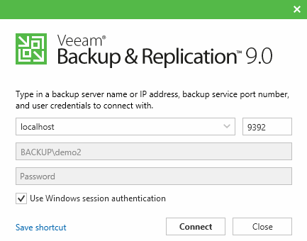
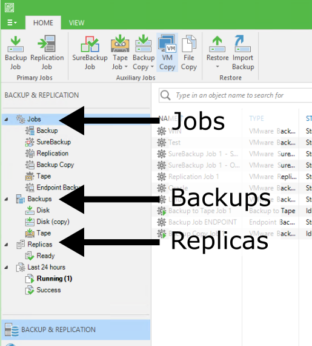
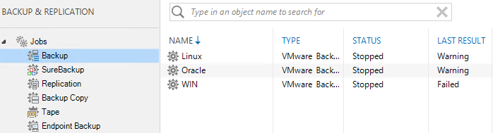
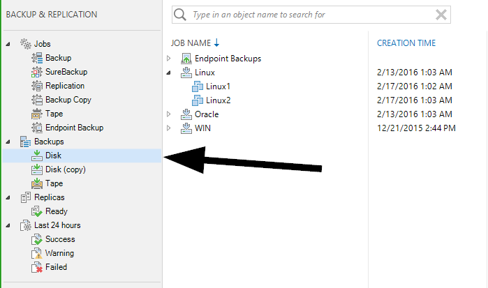
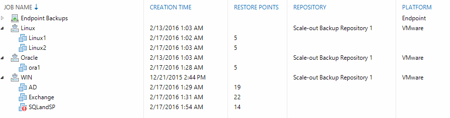
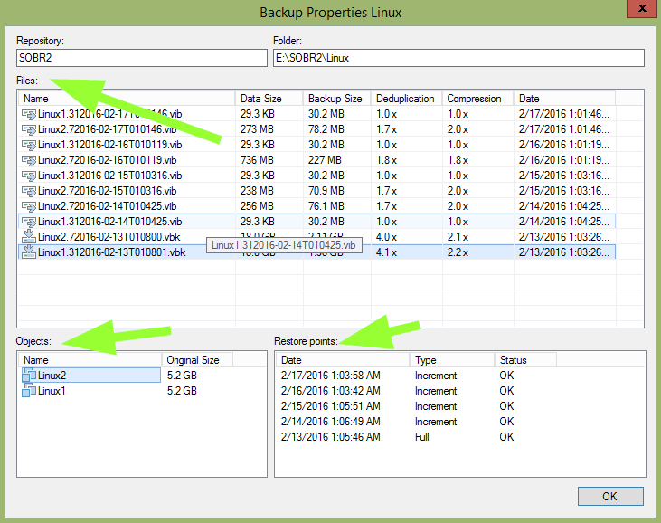
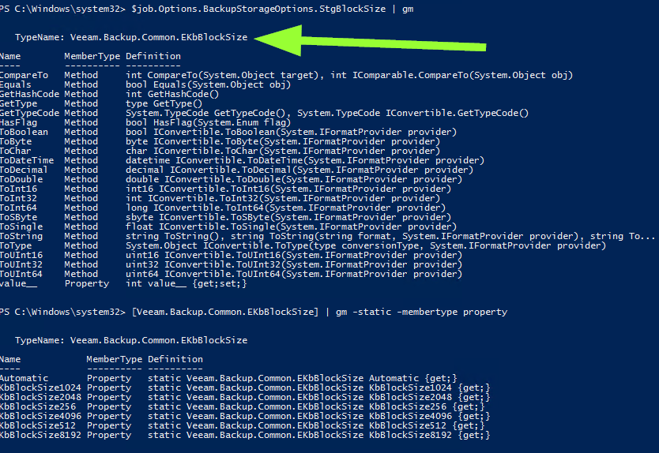

% Visual Spaghetti

# Get Started
The snapin for veeam is called the "veeampssnapin". Load it before any script. You need to be local administrator to run it
` asnp veeampssnapin `

# Connecting to a server
A server is called a "vbrserver" to differentiate from regular servers. Connecting does not have to be done if you are running on localhost itself



Connect
` connect-vbrserver -server localhost -user john -password doe `
Disconnect
` disconnect-vbrserver`

Here is a simple example getting all the jobs with last run time
```
connect-vbrserver -server localhost 
get-vbrjob | % { write-host ("{0,-20} {1}" -f $_.name,$_.FindLastSession().Endtime) }
disconnect-vbrserver
```

# Jobs
Jobs are literally the things that are scheduled to run and produce backups, replica's, etc.



In powershell they are called "vbrjob". 
` get-vbrjob `

For example, get all backup jobs, filter on jobtype



` get-vbrjob | ? { $_.jobtype -match "Backup" } `

or get all replica jobs
` get-vbrjob | ? { $_.jobtype -match "Replica" } `

# Backups
## General View
Backups are the result of a job running or multiple times. It is a collection of all backup files. If they are not located under "imported" node, it means they are mapped to a Job


In powershell they are called "vbrbackup". 
` get-vbrbackup `

To get for example the primary jobs (found under Disk Node), you can use a filter



`get-vbrbackup | ? { $_.JobType -match "^(Endpoint)?Backup$" }`

All possible types can be listed by using
`[Veeam.Backup.Model.EDbJobType] | gm -Static -MemberType property`

Most common are:

* Backup
* BackupSync
* Replica
* EndpointBackup

## Side Panel


Let's reproduce the image. First, let look at a backup object
`$backup = @(get-vbrbackup)[0]`

To find out all VMs in the backup, you can query it's objects
`$backup.GetObjects()`

To find out all restore points with VMs, you can use GetOibs (Probably stands for "Object in Backup" or "Orange is Black", your guess is as good as mine)
`$backup.GetOibs()`

You could then count the amount of points per VM
```
$oibs = $backup.GetOibs()
$vms = $backup.GetObjects()

foreach ($vm in $vms) {
    $relatedobs = @($oibs | ? { $_.ObjectId -eq $vm.Id })
    Write-Host ("{0} {1}" -f $vm.Name,$relatedobs.Count)
}
```

Or you use the summary method GetObjectOibsAll()
```
foreach ($vmoib in $backup.GetObjectOibsAll()) {
	Write-Host ("{0} {1}" -f $vmoib.Name,$vmoib.CountOfValidOibs)
}
```

So lets make a table with the info we know now
```
$backups = get-vbrbackup | ? { $_.JobType -match "^(Endpoint)?Backup$" }
$table = @()
foreach ($backup in $backups) {
 $objects = $backup.GetObjectOibsAll()
 foreach ($object in $objects) {
     $table += New-Object -TypeName psobject -Property @{
        BackupName=$backup.Name;
        ObjectName=$object.Name;
        ObjectCount=$object.CountOfValidOibs;
        ObjectCreationTime=$object.CreationTime
     }
 }
 
}
$table | Sort-Object -Property "BackupName" | select BackupName,ObjectName,ObjectCount,ObjectCreationTime
```

## Backup specific properties

You get the following view when you select and individual backup, right click it and select properties



Let's reproduce the image in parts. First, let select a certain backup
`$backup = get-vbrbackup -Name "Linux"`

The individual backups "files" are stored in "storages" 
`$backup.GetAllStorages()`

So reproducing this first table is quite easy
```
$backup = get-vbrbackup -Name "Linux"

$storages = $backup.GetAllStorages()
$table = @()
foreach ($storage in $storages) {
    
     $table += New-Object -TypeName psobject -Property @{
        Name=$storage.FilePath;
        DataSize=$storage.Stats.DataSize;
        BackupSize=$storage.Stats.BackupSize;
        Deduplication=[math]::round(100/$storage.stats.DedupRatio,2);
        Compression=[math]::round(100/$storage.Stats.CompressRatio,2);
        Date=$storage.CreationTime;
     }
}
$table | Sort-Object -property Date -Descending  | select Name,DataSize,BackupSize,Deduplication,Compression,Date | ft
```

The second part is the restore points. To get the restore points, you actually have a cmdlet (get-vbrrestorepoint). Funny enough, it returns Oibs and it is not the same as GetPoints() on the backup object
`$restorepoints = Get-VBRRestorePoint -Backup $backup`

```
$backup = get-vbrbackup -Name "Linux"

$restorepoints = Get-VBRRestorePoint -Backup $backup
$table = @()
foreach ($rp in $restorepoints) {
     $table += New-Object -TypeName psobject -Property @{
        Type=$rp.Algorithm;
        Point=$rp.PointId;
        Date=$rp.CreationTime;
        VMName=$rp.VmName;
        OriginalSize=$rp.ApproxSize;
     }
}
$table | Sort-Object -property Date -Descending | select VMName,OriginalSize,Type,Date,Point | ft
```


# Replica's
Replica are the result of a replica job running or multiple times. It is a collection of a VM + snapshots


In powershell they are called "vbrreplica". 
` get-vbrreplica `


# How to discover
The documentation is probably not complete, and since it is not official, any version release might brake any syntax. So giving men fish is not always the solution.

Here are some tricks on how to discover code yourself

All CMDlets for Veeam
`Get-Command -module veeampssnapin`

Everything related to for example VBRBackup (should give you get-, export-, import- and remove-vbrbackup)
`Get-Command -module veeampssnapin -noun vbrbackup`

If you want a family of subset, you can do a regex match filter
`Get-Command -module veeampssnapin | ? { $_.Noun -match "VBRJob" }`

All Object types
`Get-Command -module veeampssnapin | % { $_.Noun } | sort-object | get-unique`

Let's asume a job is stored in \$job (at least one job must be created for this to work)
`$job = @(get-vbrjob)[0]`

If you just run \$job, it might show you some of the properties but maybe not all
`$job`

If you want a list of all methods() and properties, pipe your object to get-member (or gm, it's shorthanded alias)
`$job | get-member`

This will reveal for example the metho FindLastSession. If you run the method with arguments in the brackets (check definition column) it will give you a result. In the case of FindLastSession, there are no arguments
`$job.FindLastSession()`

Sometimes you want to know the possible values you can use for creating new stuff or to filter on values. If you already have some examples in the gui, you can just output every object value
`foreach ($job in (get-vbrjob)) { write-host $job.jobtype }`

If you don't have a predefined job of that type, you can still find the values. First, you need an object, let's say \$job and it's property jobtype
`$job.jobtype | get-member`

This should output something starting with "TypeName: Veeam.Backup.Model.EDbJobType". This is the typename. Put it between square brackets to ask about the type itself. You will see in this case, it's an enum
`[Veeam.Backup.Model.EDbJobType]`

By using get-member with -static and -membertype property, you will get a complete overview. 
`[Veeam.Backup.Model.EDbJobType] | get-member -static -MemberType property`

Here is another example



``` powershell
$job.Options.BackupStorageOptions.StgBlockSize | gm
[Veeam.Backup.Common.EKbBlockSize] | gm -static -membertype property
```

# FAQ
## Audience Type
People who know ((Veeam -And Powershell) && -Not Veeampssnapin)
If you didn't get this one, first brush up your powershell skills

## Why always this new objects in array style (\$table)
Cause I like this kind of setup. It allows you to export it easily to csv, html, etc

## Can I contribute | Download an offline version
Yes please! This file is written in markdown (pandoc style) and compiled with pandoc. It is hosted on <https://github.com/tdewin/visualspaghetti>

Also you could download the project as a zip. I'll try to run the bat file before I sync, so that you get an exact result 

## Some of these cmdlets don't work
Please open an issue on the <https://github.com/tdewin/visualspaghetti>

## Readme looks strange on github
Cause Github markdown uses a differnt dialect than pandoc, and it misses the stylesheet

Go to <http://dewin.me/visualspaghetti/> for a rendered version