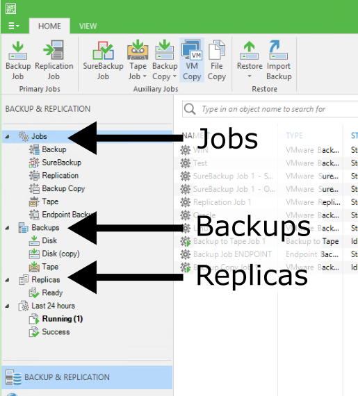
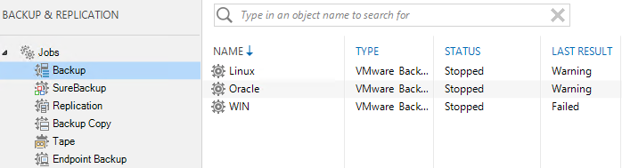
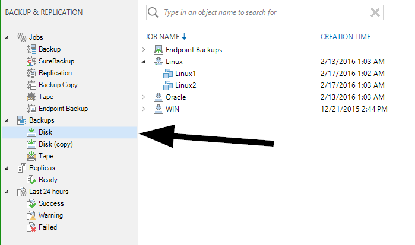
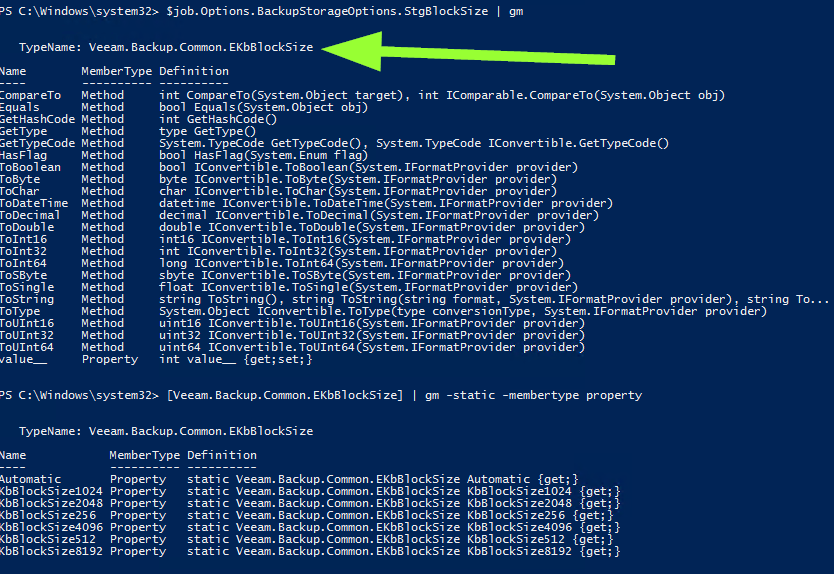

% Visual Spaghetti

# Get Started
The snapin for veeam is called the "veeampssnapin". Load it before any script. You need to be local administrator to run it
` asnp veeampssnapin `

# Connecting to a server
A server is called a "vbrserver" to differentiate from regular servers


Connect
` connect-vbrserver -server localhost -user john -password doe `
Disconnect
` disconnect-vbrserver -server localhost -user john -password doe `

# Jobs
Jobs are literally the things that are scheduled to run and produce backups, replica's, etc.



In powershell they are called "vbrjob". 
` get-vbrjob `

For example, get all backup jobs, filter on jobtype



` get-vbrjob | ? { $_.jobtype -match "Backup" } `

or get all replica jobs
` get-vbrjob | ? { $_.jobtype -match "Replica" } `

# Backups
Backups are the result of a job running or multiple times. It is a collection of all backup files. If they are not located under "imported" node, it means they are mapped to a Job


In powershell they are called "vbrbackup". 
` get-vbrbackup `

To get for example the primary jobs (found under Disk Node), you can use a filter



`get-vbrbackup | ? { $_.JobType -eq "Backup" }`

All possible types can be listed by using
`[Veeam.Backup.Model.EDbJobType] | gm -Static -MemberType property`

Most common are:

* Backup
* BackupSync
* Replica
* EndpointBackup

So let's assume there is one backup job stored in $backup
` $backup = @(get-vbrbackup)[0] `

The individual backups files are stored in "storages"
` $backup.GetAllStorages() `

The stats is a property of a storage. To get a similar result as shown below, you can go over the storages as followed
``` powershell
$storages = $backup.GetAllStorages()  | Sort-Object -Property creationtime -Descending
foreach ($storage in $storages) {
    $stats = $storage.Stats
    $filepath = $storage.FilePath
    $time = $storage.CreationTime

    write-host ("{0,5} {1,5} {2,5} {3,5} {4} {5} " -f [int]($stats.DataSize/1MB),$stats.DedupRatio,$stats.CompressRatio,[int]($stats.BackupSize/1MB), $time,$filepath)
} 
```

# Replica's
Replica are the result of a replica job running or multiple times. It is a collection of a VM + snapshots


In powershell they are called "vbrreplica". 
` get-vbrreplica `


# How to discover
The documentation is probably not complete, and since it is not official, any version release might brake any syntax. So giving men fish is not always the solution.

Here are some tricks on how to discover code yourself

All CMDlets for Veeam
`Get-Command -module veeampssnapin`

Everything related to for example VBRBackup (should give you get-, export-, import- and remove-vbrbackup)
`Get-Command -module veeampssnapin -noun vbrbackup`

If you want a family of subset, you can do a regex match filter
`Get-Command -module veeampssnapin | ? { $_.Noun -match "VBRJob" }`

All Object types
`Get-Command -module veeampssnapin | % { $_.Noun } | sort-object | get-unique`

Let's asume a job is stored in \$job (at least one job must be created for this to work)
`$job = @(get-vbrjob)[0]`

If you just run \$job, it might show you some of the properties but maybe not all
`$job`

If you want a list of all methods() and properties, pipe your object to get-member (or gm, it's shorthanded alias)
`$job | get-member`

This will reveal for example the metho FindLastSession. If you run the method with arguments in the brackets (check definition column) it will give you a result. In the case of FindLastSession, there are no arguments
`$job.FindLastSession()`

Sometimes you want to know the possible values you can use for creating new stuff or to filter on values. If you already have some examples in the gui, you can just output every object value
`foreach ($job in (get-vbrjob)) { write-host $job.jobtype }`

If you don't have a predefined job of that type, you can still find the values. First, you need an object, let's say \$job and it's property jobtype
`$job.jobtype | get-member`

This should output something starting with "TypeName: Veeam.Backup.Model.EDbJobType". This is the typename. Put it between square brackets to ask about the type itself. You will see in this case, it's an enum
`[Veeam.Backup.Model.EDbJobType]`

By using get-member with -static and -membertype property, you will get a complete overview. 
`[Veeam.Backup.Model.EDbJobType] | get-member -static -MemberType property`

Here is another example



``` powershell
$job.Options.BackupStorageOptions.StgBlockSize | gm
[Veeam.Backup.Common.EKbBlockSize] | gm -static -membertype property
```